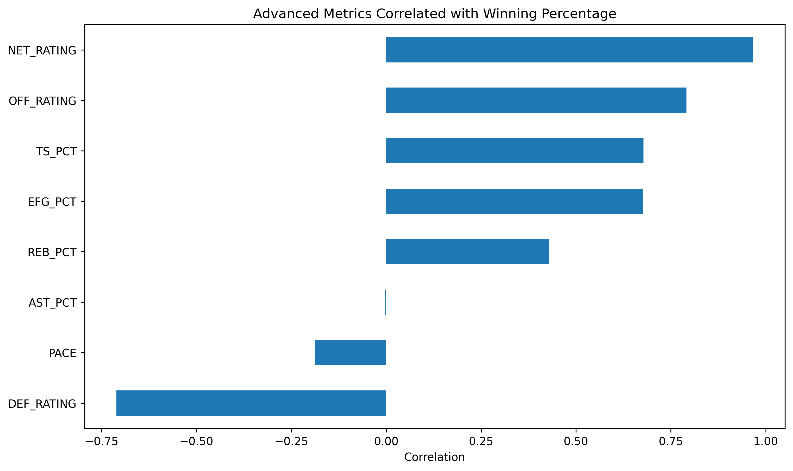

# NBA Team Success Analysis

## Project Overview

This project analyzes NBA team statistics from the 2021-22 through 2024-25 seasons to determine which performance metrics are most strongly associated with winning percentage.

## Business Question

Which statistics best explain NBA team success?

## Dataset

Source: NBA Stats API 

- 4 NBA seasons (2021-2025)
- 120 Team-Season Observations
- Traditional and Advanced Team Metrics

## Tools Used

- Python
- Pandas
- Matplotlib 
- Seaborn
- Scikit-learn
- Jupyter Notebook
- Git
- GitHub 

## Methodology

1. Retrieved team statistics using the NBA Stats API.
2. Combined four seasons into a single dataset.
3. Performed exploratory data analysis.
4. Conducted correlation analysis.
5. Built a regression model using Net Rating 
6. Identified overperforming and underperforming teams. 

## Traditional Metrics Findings

### Correlation Matrix

### Top Drivers of Winning 

Key Findings: 

- Point Differential (PLUS_MINUS): 0.97
- Three Point Percentage: 0.67
- Field Goal Percentage: 0.61
- Turnovers: -0.53

## Advanced Metrics Findings 

Key Findings: 

- Net Rating: 0.97
- Offensive Rating: 0.79
- True SHooting Percentage: 0.68
- Effective Field Goal Percentage: 0.68
- Defensive Rating: -0.71

## Overperformers vs Underperformers

The project compared actual winning percentage to winning percentage predicted by Net Rating. 

Key Overperformers:

- Milwaukee Bucks (2022-23)
- Portland Trail Blazers (2021-22)
- Los Angeles Lakers (2024-25)

Key Underperformers:

- Indiana Pacers (2021-22)
- San Antonio Spurs (2021-22)
- Boston Celtics (2021-22)

## Key Conclusions

Advanced efficieny metrics explain team success substantially better than traditional box score statistics. 

Net Rating emerged as the strongest predictor of winning percentage across all four NBA seasons analyzed. 
