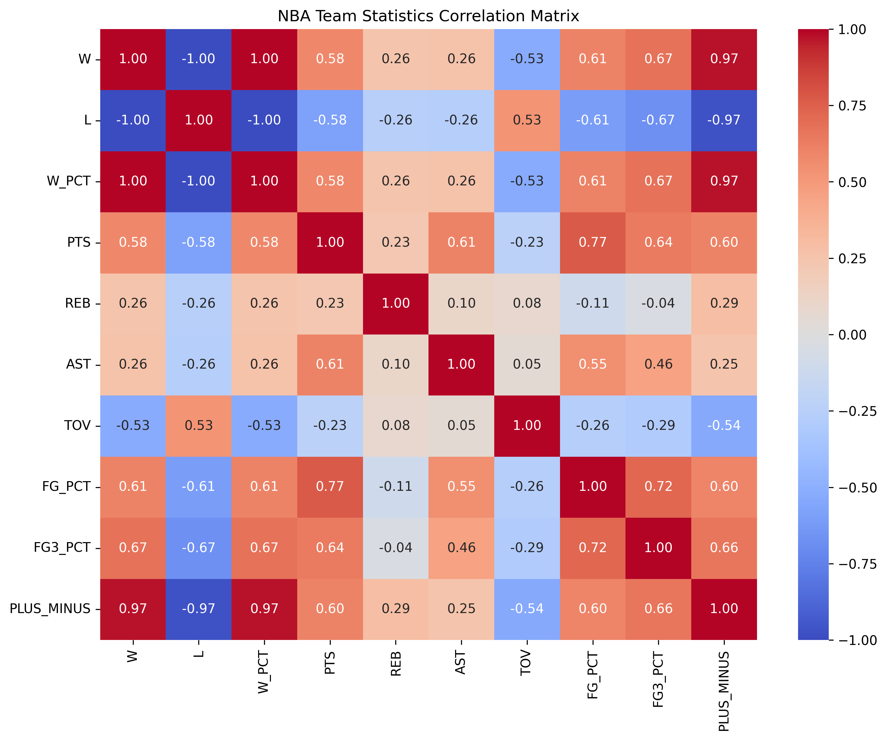
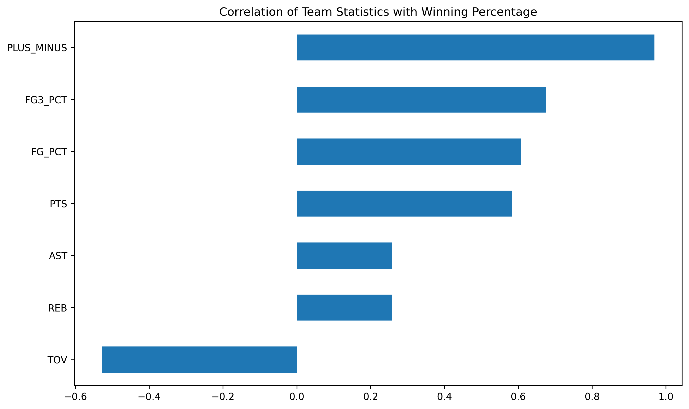

# NBA Team Success Analysis

## Project Overview

This project analyzes NBA team statistics from the 2021-22 through 2024-25 seasons to determine which performance metrics are most strongly associated with winning percentage.

## Business Question

Which team statistics are most strongly associated with winning in the NBA?

## Dataset

Source: NBA Stats API (nba_api)

Seasons:
- 2021-22
- 2022-23
- 2023-24
- 2024-25

Observations:
- 120 team-season records
- 30 NBA teams across four seasons

## Tools Used

- Python
- Pandas
- Jupyter Notebook
- Matplotlib
- Seaborn
- Git

## Methodology

1. Retrieved team statistics using the NBA Stats API.
2. Combined four seasons into a single dataset.
3. Performed exploratory data analysis.
4. Calculated correlations between team metrics and winning percentage.
5. Visualized relationships using heatmaps and bar charts.

## Key Findings

### Point Differential Was the Strongest Predictor of Winning

PLUS_MINUS showed a correlation of 0.97 with winning percentage.

### Shooting Efficiency Matters

Three-point percentage and overall field-goal percentage showed strong positive relationships with winning.

### Turnovers Negatively Impact Success

Teams with higher turnover rates tended to have lower winning percentages.

## Future Improvements

- Add advanced metrics (Offensive Rating, Defensive Rating)
- Build an interactive Power BI dashboard
- Develop predictive models for playoff qualification

## Visualizations

### Correlation Matrix

### Drivers of Winning

